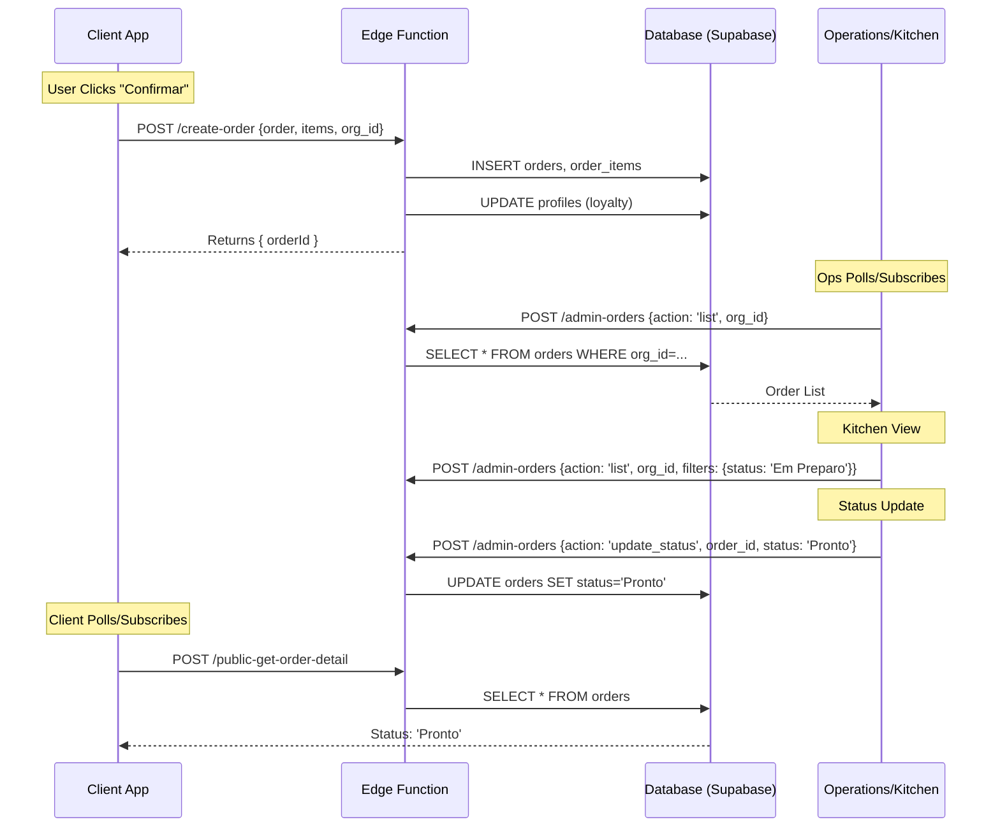

# End-to-End Order Flow Audit

## Overview
This document maps the complete lifecycle of an order from creation in the Client App to processing in Operations/Kitchen and final delivery.

## 1. Flow Diagram

## 2. Technical Details

### Step 1: Creation (Client -> Backend)
- **Source**: `CheckoutScreen.tsx` calls `CartContext.createOrder`.
- **Function**: `supabase/functions/create-order`
- **Data Written**:
    - `public.orders`: Main record (`id`, `org_id`, `status='Recebido'`, `total`).
    - `public.order_items`: Line items.
    - `public.loyalty_transactions`: If points used.
- **Validation**:
    - Checks `org_id`.
    - Validates Loyalty Balance (if applicable).
    - **Note**: `org_id` is trusted from client body in `CheckoutScreen`.

### Step 2: Operations & Kitchen (Backend Read)
- **Function**: `supabase/functions/admin-orders`
- **Logic**:
    - `action: 'list'` fetches all orders for an `org_id`.
    - **Kitchen View**: Likely filters this list by status (e.g., `Recebido`, `Em Preparo`).
- **Security**:
    - Requires Service Role Key or Authenticated Admin User (checked via `supabase.auth.getUser`).

### Step 3: Updates (Ops -> Backend)
- **Function**: `supabase/functions/admin-orders`
- **Logic**:
    - `action: 'update_status'` updates `status` column.
    - Statuses used: `Recebido` -> `Em Preparo` -> `Pronto` -> `A caminho` -> `Entregue`.

### Step 4: Client Feedback (Backend -> Client)
- **Source**: `OrderDetailScreen.tsx` / `OrdersScreen.tsx`.
- **Function**: `supabase/functions/public-get-customer-orders` and `public-get-order-detail`.
- **Consistency**:
    - Both Client and Admin use the same text entries for Status (Portugal Portuguese).

## 3. Data Consistency Checklist
- **`org_id`**:
    - ✅ Client sends it in `create-order`.
    - ✅ Admin strictly filters by it in `admin-orders` (cannot see data across orgs).
    - ✅ Client fetch strictly filters by it.
- **Status Enum**:
    - ✅ Defined in `src/types.ts` (`OrderStatus`).
    - ✅ Matches Database text values.

## 4. Manual Test Script

### Scenario 1: Delivery Order (Full Flow)
1.  **Setup**: Open Client App (`/foodtruck-hotdog`). Login as User.
2.  **Action**: Add items to cart. Go to Checkout. Select "Entrega". Confirm.
3.  **Verify (Client)**: Redirects to Success. Status shows "Recebido".
4.  **Action (Ops)**: (Simulate via Postman/Curl) Call `admin-orders` with `action: 'list'`. Verify order appears.
5.  **Action (Ops)**: Call `admin-orders` to update status to "Em Preparo".
6.  **Verify (Client)**: Refresh Order Detail. Status should change to "Em Preparo".

### Scenario 2: Pickup Order
1.  **Setup**: Client App -> Checkout. Select "Retirada".
2.  **Action**: Confirm Order.
3.  **Verify**: Address fields hidden? Order created with "Retirada" in address field or type?
    - *Note*: `order.customer_address` usually stores "Retirada no Local" string for pickup.

### Scenario 3: Order with Observations
1.  **Setup**: Add item. Add observation "Sem cebola".
2.  **Action**: Confirm Order.
3.  **Verify (Ops)**: Call `admin-orders`. Check `items` array. `notes` field should contain "Sem cebola".

